# Memrise - Product Requirements Document

## 1. Overview

**Product Name:** Memrise

**Purpose:** Memrise is a language learning platform that helps users learn new languages through immersive, culturally rich content delivered via native speaker videos, AI-powered conversations, community-created word lists, structured reading experiences, and experimental prototype features. The product combines spaced repetition vocabulary learning with authentic cultural context, AI conversation practice, and pronunciation coaching to help learners progress from complete beginners to advanced speakers.

**Target Users:**
- Casual language learners exploring a new language for travel, fun, or personal enrichment
- Students preparing for language exams (IELTS, GCSE, A-Level, IB, CEFR-aligned)
- Professionals needing a second language for work or relocation
- Heritage speakers reconnecting with family languages
- Self-directed learners who prefer authentic, culturally immersive content over textbook-style drills

**Value Proposition:** Unlike traditional flashcard apps, Memrise immerses learners in real-world language through native speaker videos, AI conversation partners, pronunciation coaching, and culturally grounded stories. The platform offers structured self-study courses, a comprehensive "Speak" practice hub, an "Explore" discovery area, and experimental prototypes in Memrise Labs, catering to learners at every level across 150+ languages.

**Deployment Model:** Web application (memrise.com / app.memrise.com), with companion mobile apps (iOS and Android). The platform has undergone a "Spring Cleaning" reorganization that restructures navigation into four main tabs: Home, Learn, Speak, and Explore, consolidating previously scattered features into a cleaner information architecture.

---

## 2. Features

### 2.1 Marketing & Landing Page

| Feature | Description | Status |
|---------|-------------|--------|
| Landing Page | Public-facing marketing page with product pitch, "How It Works" carousel (4 slides), audience personas (Traveler, Student, Professional), "Is Memrise for me?" FAQ section, and call-to-action for signup | **Stable** |
| Language Catalog | Searchable grid of 150+ languages available for learning, accessible from both marketing and onboarding flows | **Stable** |
| Exam Prep Promotion | Marketing section promoting IELTS, GCSE, A-Level, IB, and CEFR-aligned exam preparation with AI-powered feedback | **Stable** |
| Blog | Content marketing blog ("MemNews") with language learning tips, cultural insights, and product updates | **Stable** |
| Courses | Legacy feature - course pages now show 404 error. Navigation menu item still exists | **Deprecated** |
| Phrasebooks | Legacy feature - phrasebook pages show "this page doesn't exist" notice with link to Community Word Lists. Navigation menu item still exists | **Deprecated** |

### 2.2 Signup & Onboarding

| Feature | Description | Status |
|---------|-------------|--------|
| Language Selection | Searchable grid of 150+ target languages during signup. Languages displayed with native script names | **Stable** |
| Account Creation | Email/password signup plus social auth (Google, Facebook, Apple). Interface available in 23 languages | **Stable** |
| Skill Level Assessment | 4-level self-assessment: Learn from scratch, Getting started, Making good progress, Improving my skills | **Stable** |
| Goal Selection | Multi-select learning goals that influence word list recommendations | **Stable** |
| Word List Curation | System-suggested word lists based on goals, with option to browse community lists | **Stable** |
| Commitment Selection | Free vs Pro tier selection with 3-day free trial offer; appears once during onboarding | **Stable** |
| Choose Plan (Onboarding) | Pricing page integrated into onboarding flow showing Monthly, Annual, and Lifetime options | **Stable** |

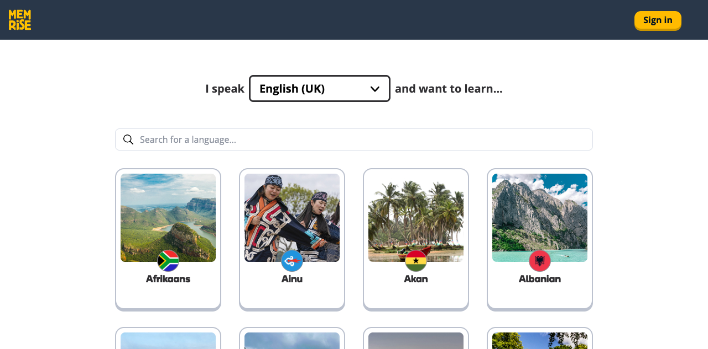

### 2.3 Self-Study App (Core Learning)

| Feature | Description | Status |
|---------|-------------|--------|
| Dashboard / Home | Central hub showing current word list progress, pronunciation card, immerse (video) card, and quick access to all features. Spring Cleaning layout uses a focused card-based design with current wordlist prominent | **Stable** |
| Learn Tab (Vocabulary Hub) | Consolidated vocabulary learning hub with current word list, practice/review cards (Classic Review, Speed Review, Difficult Words), Arabic Script card, My Words dashboard card, and Word Lists card | **Stable** |
| Vocabulary Lessons | Structured lessons presenting new words with native speaker videos, audio pronunciations, literal translations, and cultural "Did you know?" tips. Configurable session sizes (3/5/7/10 words) | **Stable** |
| Video Quiz Testing | Multiple-choice quizzes using native speaker video clips for recall testing | **Stable** |
| Vocabulary Management (My Words) | Words tracked across three states: Learned, Heard, Used. Users can review difficult words and create custom word lists | **Stable** |
| Video Library (Immerse) | Filterable library of native speaker video lessons. Filter by: All, Ready to watch, Watched, Needs practice. Searchable by topic | **Stable** |
| Practice & Review | Three review modes: Classic Review (spaced repetition), Speed Review (timed rapid-fire), Difficult Words (targeted weak-area practice). Each with configurable session sizes | **Stable** |
| Streak Tracking | Daily learning streak counter encouraging consistent practice. Streak modal celebrates milestones | **Stable** |
| My Journey | Progress tracker showing current learning stage with levels, points, and stage progression visualization | **Stable** |
| My Activities | Activity statistics dashboard showing learning metrics over 7-day and 30-day windows, with per-activity breakdowns | **Stable** |
| Community Word Lists | Browse thousands of user-created word lists organized by popularity and recency. Users can create, share, and subscribe to lists. Community reporting/flagging for quality control | **Stable** |
| Upsell Banner | Contextual banner on dashboard promoting Pro upgrade with dynamic pricing and feature highlights | **Stable** |

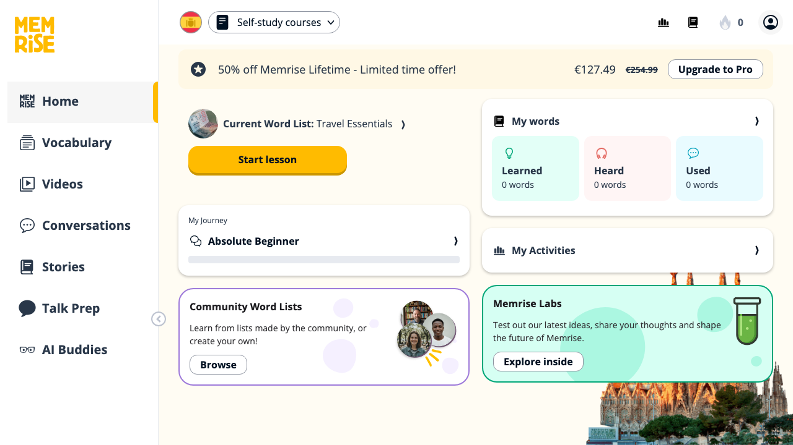

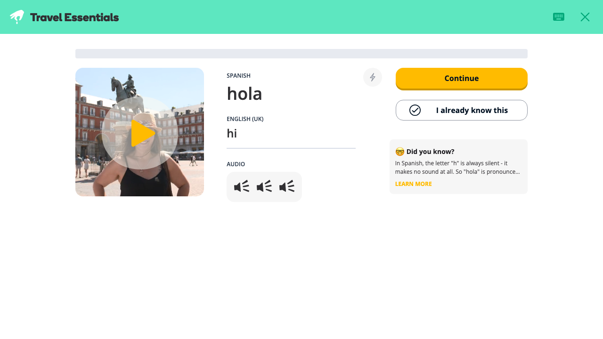

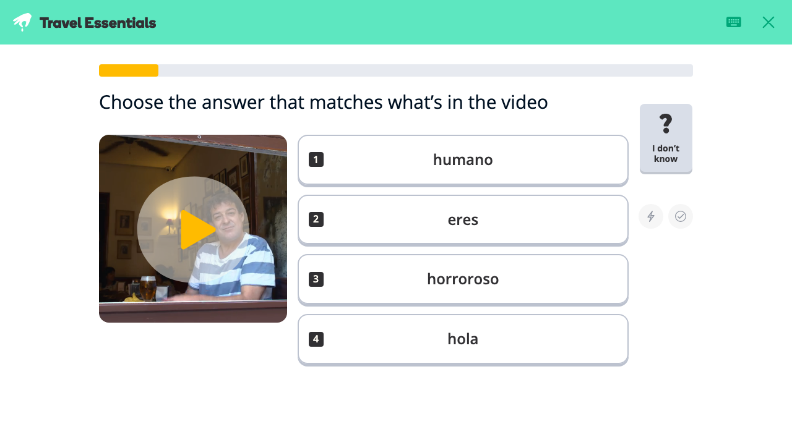

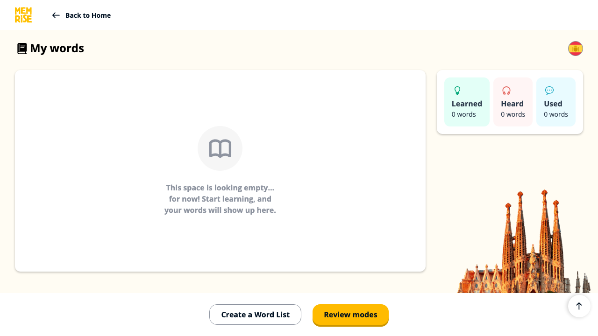

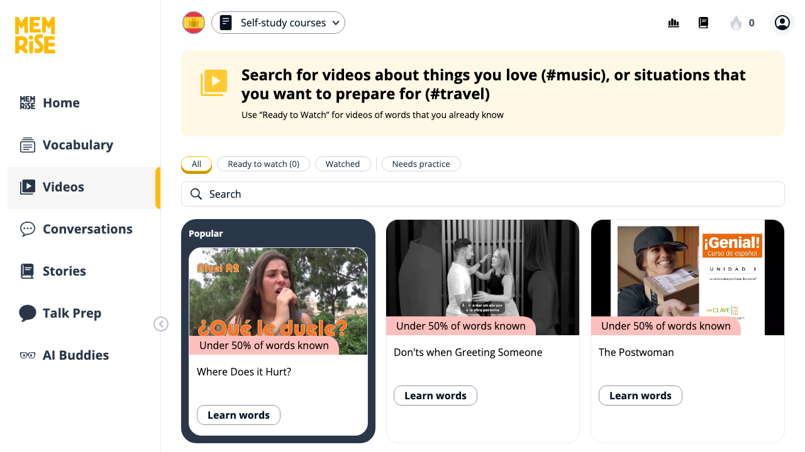

### 2.4 Speak Tab (Conversation & Pronunciation Practice)

| Feature | Description | Status |
|---------|-------------|--------|
| Speak Hub | Consolidated speaking practice page combining pronunciation exercises and conversation missions. Shows a "not available" banner for unsupported language pairs | **Stable** |
| Pronunciation Practice | AI-powered pronunciation coaching via a dedicated "Pronunciation Buddy." Provides real-time feedback on spoken words and phrases | **Stable** |
| Conversation Missions (MemBot) | AI-powered chatbot for role-play conversational practice. 150+ scenario-based conversations organized by topic. Each conversation has a scenario description, goal, and character. Features: per-message audio playback, translate button, like/dislike feedback, edit user messages, hint button, microphone input, and auto-translation | **Stable** |
| Conversation Recommendations | Personalized mission recommendations based on learning progress, displayed prominently on the Speak page | **New** |
| Topic Filtering | Filter conversation missions by topic using radio button pills (All, plus topic categories extracted from available missions) | **Stable** |
| Free Tier Message Limits | Free users limited to approximately 10 messages per conversation session. "Messages left: N" displayed in input field. Pro subscribers have unlimited messages | **Stable** |

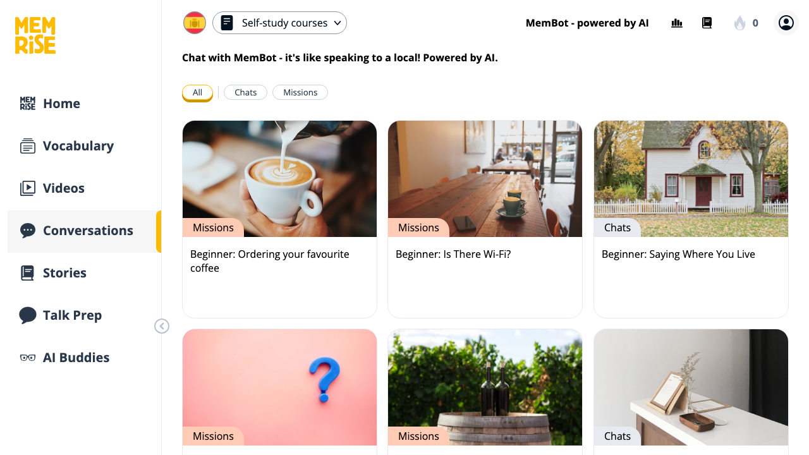

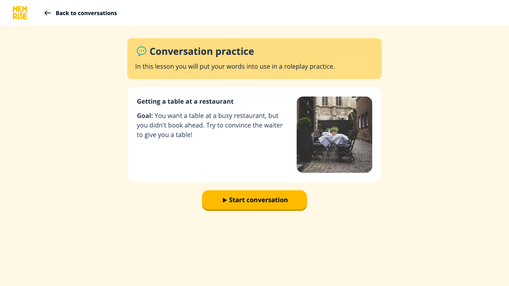

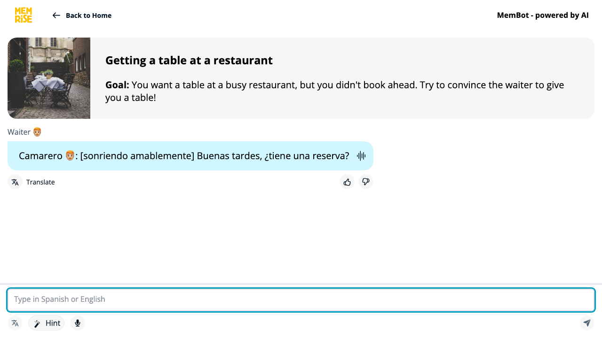

### 2.5 Explore Tab (Discovery & Experimental Features)

| Feature | Description | Status |
|---------|-------------|--------|
| Explore Hub | Discovery page consolidating Labs, Stories, Talk Prep, Skills Check, and AI Buddies into a single grid-based card layout with My Journey and My Activities dashboard cards below | **New** |
| Memrise Labs | Experimental feature hub with 11 production prototypes: Character Writing Practice, Word Nuggets, My Grammar, Verb Conjugation Practice, Virtual Tutor, New Talk Back Mode, Arabic Script, Speak for Real, Interactive English Podcasts, Skills Check, Memrise Stories. Additional non-production prototypes in development | **Beta** |
| Memrise Stories | Story-based reading experience with a 5-step flow: First Read, Discover, Re-read, Check, Score. Separate onboarding with name, language, level, and interest selection. Categories include Food & Markets, Community & Local Life, Traditions & Celebrations | **Beta** |
| Talk Prep | 3-step guided conversation practice: Build (shape conversation), Learn (practice saying lines), Perform (say from memory). Includes "Sound Like a Local" mode | **Beta** |
| Skills Check | Exam preparation and English level assessment tool. Covers IELTS, GCSE, A-Level, IB, and CEFR-aligned practice with AI-generated feedback | **Beta** |
| AI Buddies | Seven+ AI-powered practice tools with distinct characters: Assistant, Sentence Builder, Pronunciation, Grammar, Role-Play, Conjugation, Translator, Culture. Each adapts recommendations based on user's skill level and vocabulary. Pro-gated with token-based access | **Beta** |
| AI Buddy Dialog | Chat-based interaction with individual AI Buddies. Features title cards, message history, congratulations celebrations, and topic-based quick replies | **Stable** |

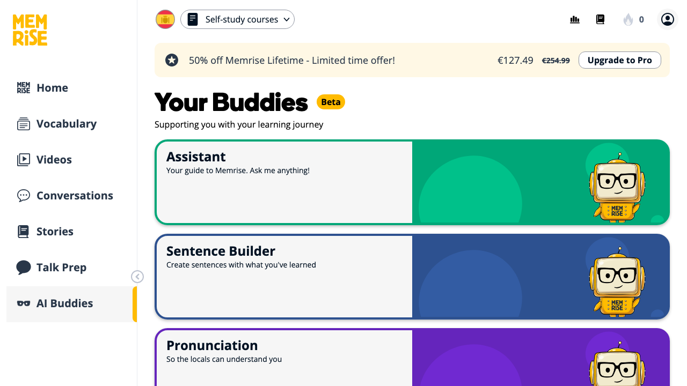

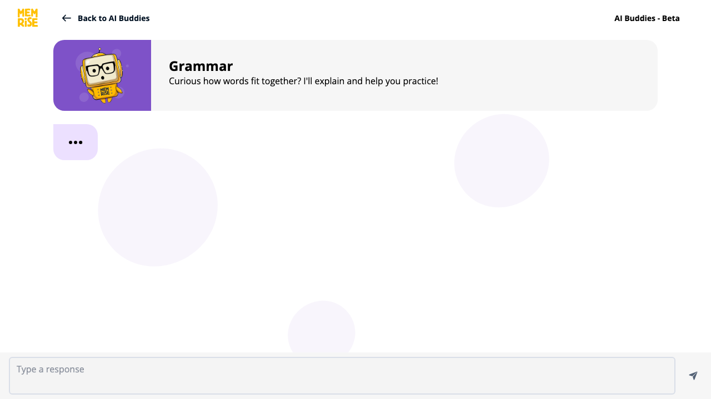

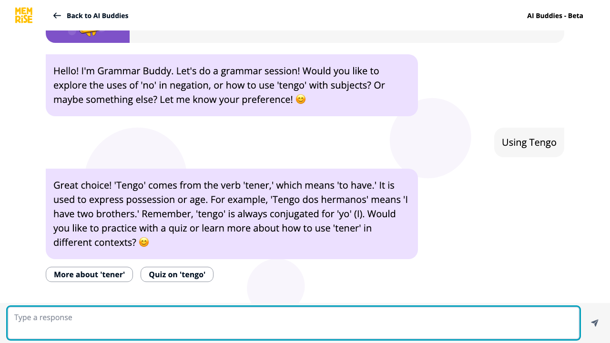

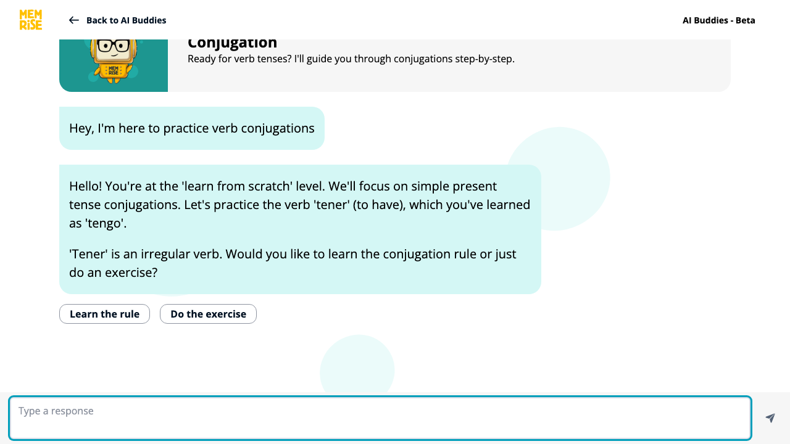

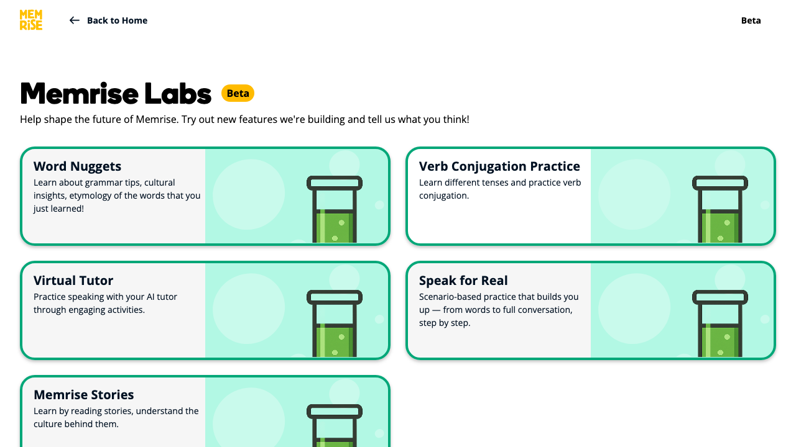

### 2.6 Monetisation & Pricing

| Feature | Description | Status |
|---------|-------------|--------|
| Pro Lifetime | €76.50 one-time (70% off from €254.99) - marked as "BEST VALUE" | **Stable** |
| Pro Annual | €69.99/year (€0.20/day) - marked as "SAVE 73%" | **Stable** |
| Pro Monthly | €21.99/month (€0.74/day) - flexible, cancel anytime | **Stable** |
| Pro Features | Extra word lists, ad-free experience, all native speaker videos, unlimited pronunciation practice, unlimited sentence building, unlimited AI conversations, grammar lessons, verb conjugation drills, extra role-play sessions, cultural & language tips, AI-powered word list generation | **Stable** |
| Feature Upsell Modal | Contextual modal shown when free users hit usage limits on gated features (videos, conversations, review modes, buddy types, wordlist AI generation) | **Stable** |
| Soft Sell Screen | Non-intrusive promotional screen highlighting Pro benefits at key moments | **Stable** |
| Free Trial | 3-day free Pro trial offered during onboarding commitment step. Trial started/expired modals manage the trial lifecycle | **Stable** |

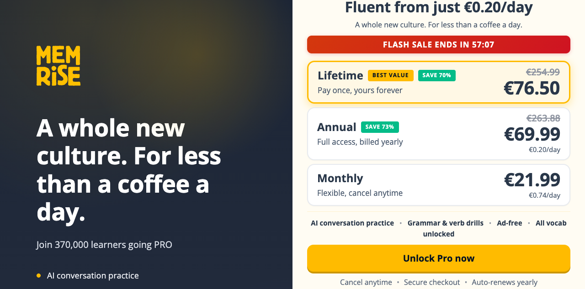

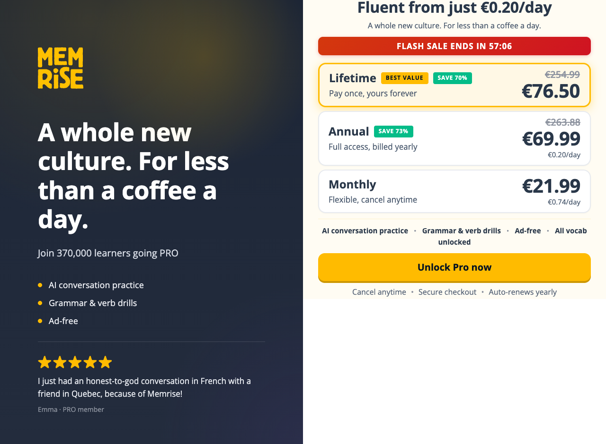

### 2.7 Account & Settings

| Feature | Description | Status |
|---------|-------------|--------|
| Sign In | Email/password plus social auth (Google, Facebook, Apple). "Forgot password" recovery flow | **Stable** |
| Profile Settings | Username and email management | **Stable** |
| Password Management | Separate password change interface | **Stable** |
| Learning Settings | Per-language configuration: skill level, streak management, words per session (Learning: 3/5/7/10, Review: 5/10/15/25/50, Speed Review: 10/25/50/100/150, Difficult Words: 5/10/15/20) | **Stable** |
| Test Type Preferences | Toggle controls for: Arrange the words tests, Typing tests, Prioritise typing in review, Audio tests | **Stable** |
| Delete Account | Account deletion with permanent data removal warning | **Stable** |
| Download Personal Data | GDPR-compliant personal data export | **Stable** |
| Stories Settings | Name, language, level, and interest preferences for the Stories product | **Stable** |
| Language Switcher | Top-bar dropdown to switch between active languages. Saving last used language pair to local storage | **Stable** |

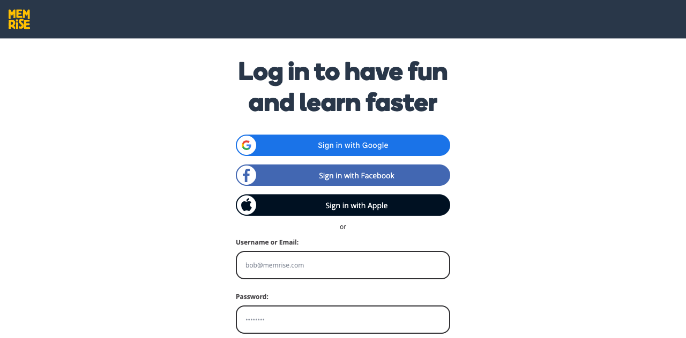

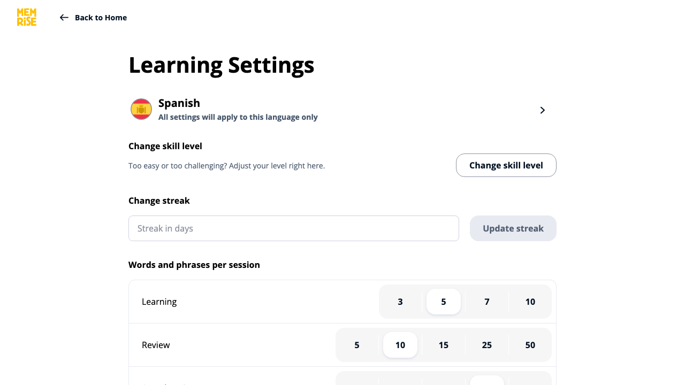

---

## 3. User Stories

### Casual Learner
- As a **casual learner**, I want to pick a language and start learning immediately, so that I can begin without any commitment or payment
- As a **casual learner**, I want to explore different learning activities (videos, conversations, stories) in one place, so that I can find what suits my learning style
- As a **casual learner**, I want to tap on words I don't know to see translations, so that I can learn at my own pace without frustration
- As a **casual learner**, I want to see my daily streak grow, so that I feel motivated to return every day

### Committed Student
- As a **committed student**, I want to track my daily streak, so that I stay motivated to practice consistently
- As a **committed student**, I want to adjust the number of words per learning session, so that I can control my study intensity
- As a **committed student**, I want to review difficult words separately, so that I can focus on areas where I struggle
- As a **committed student**, I want to practice conversations with an AI chatbot, so that I can build speaking confidence in a low-pressure environment
- As a **committed student**, I want to practice verb conjugations and grammar with AI Buddies, so that I can strengthen specific weak areas
- As a **committed student**, I want to see my learning statistics over time, so that I can track my improvement

### Exam Preparer
- As an **exam preparer**, I want to take practice tests under real exam conditions, so that I feel confident before the real thing
- As an **exam preparer**, I want to receive AI-generated feedback on my practice, so that I know how to improve my grade
- As an **exam preparer**, I want to find community word lists specific to my exam (GCSE, AP, A-Level), so that I study the exact vocabulary I'll be tested on
- As an **exam preparer**, I want to toggle typing tests on or off, so that I can practice the format my exam requires

### Travel Learner
- As a **travel learner**, I want curated "Travel Essentials" word lists, so that I learn the most useful phrases for my trip
- As a **travel learner**, I want to hear multiple native speakers say each phrase, so that I can understand different accents and speaking styles
- As a **travel learner**, I want cultural insights alongside vocabulary, so that I understand the cultural context behind what I'm learning
- As a **travel learner**, I want to practice real-world conversation scenarios (ordering food, asking directions), so that I can handle common situations

### Content Creator
- As a **community member**, I want to create and share word lists, so that other learners can benefit from my knowledge
- As a **community member**, I want to browse popular and recently created word lists, so that I can find high-quality study materials
- As a **community member**, I want to use AI to bulk-generate word entries for my custom lists, so that I can create content more efficiently (Pro feature)

### Pro Subscriber
- As a **Pro subscriber**, I want ad-free learning, so that I can focus without interruptions
- As a **Pro subscriber**, I want unlimited AI conversation and pronunciation practice, so that I can practice speaking as much as I want
- As a **Pro subscriber**, I want access to all native speaker videos, so that I get the full immersive experience
- As a **Pro subscriber**, I want unlimited access to all AI Buddies, so that I can use grammar, conjugation, translation, and cultural coaching without limits

---

## 4. Functional Requirements

| ID | Requirement |
|----|-------------|
| FR-1 | The system shall allow users to create accounts using email/password, Google, Facebook, or Apple authentication |
| FR-2 | The system shall support learning 150+ languages from multiple source languages (23 interface languages available) |
| FR-3 | The system shall present a 4-level skill assessment during onboarding and allow changes later in settings |
| FR-4 | The system shall generate personalized word list recommendations based on the user's stated goals and skill level |
| FR-5 | The system shall deliver vocabulary lessons that include native speaker video clips, multiple audio pronunciations, literal translations, and cultural context tips |
| FR-6 | The system shall test vocabulary recall through multiple-choice quizzes using video clips of native speakers |
| FR-7 | The system shall track words across three progression states: Learned, Heard, and Used |
| FR-8 | The system shall maintain a daily learning streak counter that resets if a day is missed, with a celebration modal on milestones |
| FR-9 | The system shall allow users to mark words as "difficult" for targeted review |
| FR-10 | The system shall provide a video library filterable by watch status (All, Ready to watch, Watched, Needs practice) with search |
| FR-11 | The system shall offer AI-powered conversational practice (MemBot) with 150+ scenario-based conversation topics organized by theme |
| FR-12 | The system shall provide a Speak hub combining pronunciation practice and conversation missions with personalized recommendations |
| FR-13 | The system shall provide seven+ AI Buddy tools: Assistant, Sentence Builder, Pronunciation, Grammar, Role-Play, Conjugation, Translator, and Culture |
| FR-14 | The system shall allow users to browse, search, create, and subscribe to community-created word lists |
| FR-15 | The system shall present stories in a 5-step reading flow: First Read, Discover, Re-read, Check, Score |
| FR-16 | The system shall provide tap-to-translate functionality on individual words within stories |
| FR-17 | The system shall offer audio playback of stories at normal and slow speeds |
| FR-18 | The system shall categorize story vocabulary into Key Phrases, Slang & Vocabulary, and Cultural Insights |
| FR-19 | The system shall allow users to save vocabulary and phrases from stories to a personal Notebook |
| FR-20 | The system shall provide a bilingual re-read mode with a toggle to hide translations |
| FR-21 | The system shall test comprehension through sentence reordering exercises |
| FR-22 | The system shall collect self-assessment ratings for comprehension level, enjoyment, and difficulty after each story |
| FR-23 | The system shall organize stories by category and metadata (type, reading time, origin country) |
| FR-24 | The system shall offer configurable session sizes for Learning (3/5/7/10), Review (5/10/15/25/50), Speed Review (10/25/50/100/150), and Difficult Words (5/10/15/20) |
| FR-25 | The system shall allow users to toggle test types: Arrange words, Typing, Prioritised typing in review, and Audio tests |
| FR-26 | The system shall support three subscription tiers: Monthly (€21.99), Annual (€69.99/yr), and Lifetime (€76.50, 70% off from €254.99) |
| FR-27 | The system shall gate Pro features behind the paid subscription with per-feature token-based access controls |
| FR-28 | The system shall allow account deletion with a permanent data removal warning |
| FR-29 | The system shall provide GDPR-compliant personal data download |
| FR-30 | The system shall support per-language learning settings (each language can have its own skill level, session sizes, and test preferences) |
| FR-31 | The system shall enforce message limits on free-tier AI conversations, displaying remaining count in the input field |
| FR-32 | The system shall auto-translate user messages in conversations (showing translation below the original input) |
| FR-33 | The system shall allow users to edit sent messages in conversations |
| FR-34 | The system shall provide per-message audio playback, translation, and like/dislike feedback in AI conversations |
| FR-35 | The system shall offer quick-reply topic suggestions in AI Buddy interactions that adapt based on the user's current skill level and vocabulary |
| FR-36 | The system shall provide a Memrise Labs hub showcasing beta experiments with language-pair-aware filtering |
| FR-37 | The system shall provide a "Hint" button in conversations to help users formulate responses when stuck |
| FR-38 | The system shall provide sidebar navigation that adapts by language and user state, with features appearing only for supported language pairs |
| FR-39 | The system shall provide an Explore hub consolidating discovery features (Labs, Stories, Talk Prep, Skills Check, AI Buddies) into a card-based layout |
| FR-40 | The system shall provide conversation recommendations on the Speak page based on user's learning progress |
| FR-41 | The system shall provide exam preparation with practice tests and AI-generated performance feedback |
| FR-42 | The system shall support AI-powered bulk word generation for custom word lists (Pro feature) |
| FR-43 | The system shall display a Pro trial started/expired modal to manage the trial lifecycle |

---

## 5. Business Rules

| ID | Rule |
|----|------|
| BR-1 | **Password Policy:** Passwords must be 6 or more characters |
| BR-2 | **Free vs Pro Gating:** Free users have access to all languages, basic lessons, and targeted word lists. Pro features (extra word lists, ad-free, all videos, unlimited AI, grammar, conjugation, role-play, translator, culture buddy, AI word list generation) require a paid subscription |
| BR-3 | **Streak Calculation:** Streaks increment by one for each consecutive day of learning activity (watching a video, practicing a conversation, learning or reviewing words). Missing a day resets the streak to zero. Users can manually override their streak count in Learning Settings |
| BR-4 | **Skill Level Mapping:** Users self-assess into one of four levels, which determines course starting points and content recommendations. Levels can be changed at any time in settings |
| BR-5 | **Stories Progression:** Stories follow a mandatory sequential flow (Read, Discover, Re-read, Check, Score). Users cannot skip ahead but can skip the Check exercise |
| BR-6 | **Story Comprehension Tracking:** Post-reading self-assessments feed into a comprehension progress metric displayed on the story completion summary |
| BR-7 | **Word List Subscriptions:** Users can subscribe to multiple word lists simultaneously. The current active word list is prominently displayed on the Home and Learn tabs |
| BR-8 | **Commitment Screen Sequencing:** The commitment/pricing screen appears only once during initial onboarding, after word list selection |
| BR-9 | **Per-Language Settings:** All learning settings (skill level, session sizes, test preferences) apply only to the currently selected language |
| BR-10 | **Community Word Lists:** Any user can create word lists. Lists are publicly browsable and sortable by popularity and creation date |
| BR-11 | **Notebook Persistence:** Items saved to the Notebook persist across sessions and are organized into Words, Phrases, Cultural insights, Notes, and Journal tabs |
| BR-12 | **Stories Interest-Based Curation:** Story recommendations are personalized based on the user's selected interest categories (up to 10 topics) |
| BR-13 | **Trial Offer:** New users are offered a free 3-day Pro trial during the commitment selection step |
| BR-14 | **Multi-Language Support:** Users can learn multiple languages on a single account. The language selector in the top bar allows switching between active languages, with the last-used pair saved to local storage |
| BR-15 | **Account Deletion:** Account deletion is permanent and irreversible. All learning progress is removed |
| BR-16 | **Free Tier Conversation Limits:** Free users are limited to approximately 10 messages per AI conversation session, displayed as "Messages left: N" in the input field. Pro subscribers have unlimited messages |
| BR-17 | **Language-Dependent Features:** Navigation adapts based on selected language. In Spring Cleaning mode: Speak tab shows only if pronunciation or conversations are supported; Explore tab always shows; specific features (Stories, Talk Prep, Skills Check) appear only for qualifying language pairs |
| BR-18 | **Phrasebooks & Courses Deprecated:** Former Phrasebook and Course pages display a "page doesn't exist" notice with a link to Community Word Lists. The navigation menu items still exist on the marketing site |
| BR-19 | **AI Buddy Skill Adaptation:** AI Buddies personalize their recommendations based on the user's self-assessed skill level and vocabulary they have previously learned |
| BR-20 | **Token-Based Feature Gating:** Pro features use a token-based availability system. Each feature type (videos, conversations, review modes, buddy types, pronunciation, AI word generation) has independent availability checks |
| BR-21 | **Spring Cleaning Navigation:** All users now see the Spring Cleaning layout (threshold is userId > 0, meaning all users). Navigation tabs are: Home, Learn, Speak, Explore. Videos tab appears only for non-Spring Cleaning users or those on the 2024 experience |
| BR-22 | **Labs Language Filtering:** Labs prototypes are shown/hidden based on the user's source and target language combination. Only production-ready prototypes are shown in the live environment |
| BR-23 | **Exam Prep Integration:** Exam Prep is delivered via a separate embedded application (Kotlin-based), not through the main web client SPA |

---

## 6. Domain Concepts

### User
A person who has created an account on Memrise. Users have a username, email, and password (or social auth credentials). They can learn multiple languages simultaneously, each with independent progress and settings. Users have an experience type (2024 or 2025) that determines their interface layout.

### Language Pair
The combination of a user's native language (source) and the language they are learning (target). Each language pair has its own eligibility settings determining which features are available (AI Buddies, Conversations, Videos, etc.).

### Skill Level
A self-assessed proficiency tier that determines content difficulty and starting points. Four levels exist in the core app: Learn from scratch, Getting started, Making good progress, Improving my skills. In the Stories product, three levels are used: Beginner, Intermediate, Advanced.

### Word List
A curated collection of vocabulary items. Word lists can be official (created by Memrise), community-created (by other users), or personal (created by the individual user). Each word list has a title, description, word count, and creator. Users can have one "current" active word list at a time.

### Lesson
A structured learning session that presents a configurable number of new vocabulary items. Each word in a lesson includes a native speaker video, audio pronunciations, English translation, literal translation, and a cultural "Did you know?" tip. Lessons conclude with quiz testing.

### Story
A culturally immersive reading piece in the target language. Stories are categorized by theme, tagged with metadata (type, reading time, origin country), and processed through a 5-step reading flow. Stories contain Key Phrases, Slang & Vocabulary, and Cultural Insights.

### Notebook
A personal reference collection where users save vocabulary, phrases, cultural insights, and personal notes discovered during story reading. The Notebook also includes a Journal for reflective writing.

### Streak
A consecutive-day learning counter that incentivizes daily practice. Streaks reset to zero on a missed day but can be manually adjusted in settings. A celebration modal appears when streaks grow.

### Conversation (Mission)
An AI-powered dialogue scenario using the MemBot chatbot. Conversations are organized by topic and can be filtered. Each has a scenario description, goal, and AI character. Conversations support text and voice input.

### AI Buddy
A specialized AI practice tool focused on a specific language skill. Seven+ types exist: Assistant, Sentence Builder, Pronunciation, Grammar, Role-Play, Conjugation, Translator, and Culture. Each has a distinct personality and avatar.

### Talk Prep
A guided conversation rehearsal feature with three stages: Build (shape the conversation content), Learn (practice saying the lines), and Perform (recite from memory). Includes a "Sound Like a Local" mode.

### Pro Subscription
A paid membership tier that unlocks premium features. Available in Monthly, Annual, and Lifetime pricing. Pro features are controlled via a token-based system where each feature type has independent access controls.

### Eligibility
A per-language-pair configuration that determines which features are available for a given learning combination. Controls access to AI Buddies, Conversations, Videos, and other language-dependent features.

### Labs Prototype
An experimental feature hosted externally (typically on Replit) and linked from the Memrise Labs hub. Each prototype has language pair requirements, production readiness status, and localized links.

### Points & Levels
A gamification system where users earn points through learning activities. Points contribute to level progression through numbered stages (visualized as a journey map). Level and stage celebrations mark milestones.

---

## 7. User Flows

### 7.1 New User Signup & Onboarding Flow

1. User arrives at the landing page (memrise.com)
   

2. User clicks "Start Learning" or navigates to app.memrise.com/bienvenue

3. User selects the language they want to learn from a searchable grid of 150+ languages
   

4. User creates an account with email/password or social login (Google, Facebook, Apple)
   

5. User selects their current skill level (4 options from beginner to advanced)

6. User selects their learning goals (multi-select from 6 options)

7. System suggests word lists based on goals; user can add community lists

8. User sees the commitment/pricing page (Free, Trial, or Pro)
   

9. User arrives at the Home Dashboard, ready to start their first lesson
   

### 7.2 Home Dashboard (Spring Cleaning)

1. User lands on the Home tab showing their current word list with progress and a "Start lesson" button
   

2. Below the word list card, contextual cards appear:
   - Immerse card (if videos are available for the language pair)
   - Pronunciation card (if pronunciation buddy is available)

3. An Upsell Banner at the top promotes Pro for non-subscribers

4. The sidebar shows: Home, Learn, Speak, Explore (adapting to language pair eligibility)

### 7.3 Vocabulary Learning Flow (Learn Tab)

1. User navigates to the Learn tab

2. The Learn tab shows the current active word list with lesson progress

3. Below the word list: Practice & Review cards (Classic Review, Speed Review, Difficult Words)

4. Further below: Arabic Script card (if learning Arabic), My Words dashboard card, Word Lists card

5. User clicks "Start lesson" and the system presents new words with video, audio, and cultural context
   

6. After learning the configured number of words, video quiz testing begins
   

7. Upon completion, learned words are added to "My Words" and the progress bar advances

### 7.4 Speak Tab Flow

1. User navigates to the Speak tab

2. If pronunciation buddy is available, a Pronunciation Card appears at the top

3. Below: Conversation Recommendations (AI-picked missions based on learning progress)

4. Topic filter pills allow filtering missions by category (All, plus available topics)

5. Mission cards grid shows available conversation scenarios with thumbnails and descriptions

6. User selects a mission and sees the preview screen with scenario description and goal

7. User clicks "Start conversation" and engages with the AI chatbot
   

8. If speaking is not supported for the language pair, a "Speaking practice not available" banner is shown

### 7.5 Explore Tab Flow

1. User navigates to the Explore tab

2. Card grid shows available discovery features:
   - Memrise Labs card
   - Stories card (if supported for language pair)
   - Talk Prep card (if supported)
   - Skills Check card (if supported)
   - AI Buddies card (if supported)

3. Below the cards: My Journey dashboard card and My Activities dashboard card

4. Clicking Labs opens the full Labs page with all available prototypes

5. Clicking Stories, Talk Prep, or Skills Check opens the respective external Replit-based app
   

### 7.6 AI Buddy Interaction Flow

1. User navigates to AI Buddies (via Explore tab or direct URL /buddies)
   

2. User selects a practice type (Grammar, Conjugation, Pronunciation, etc.)

3. If the buddy type is Pro-gated and user is on free tier, a Feature Upsell Modal appears

4. The AI Buddy introduces itself via a title card and offers topic suggestions tailored to the user's vocabulary
   

5. User selects a quick-reply topic or types a custom request

6. The Buddy provides an explanation with examples, then offers further practice
   

7. Congratulations messages appear when the user completes exercises successfully

### 7.7 Story Reading Flow

1. User navigates to Stories (via Explore tab)

2. First-time users complete Stories onboarding (name, language, level, interests)
   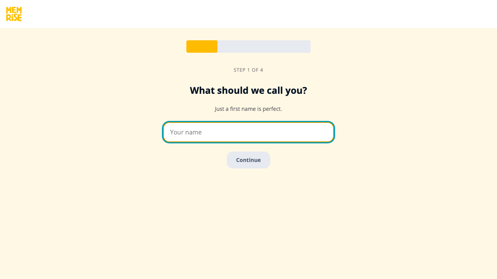

3. User selects a story from the library
   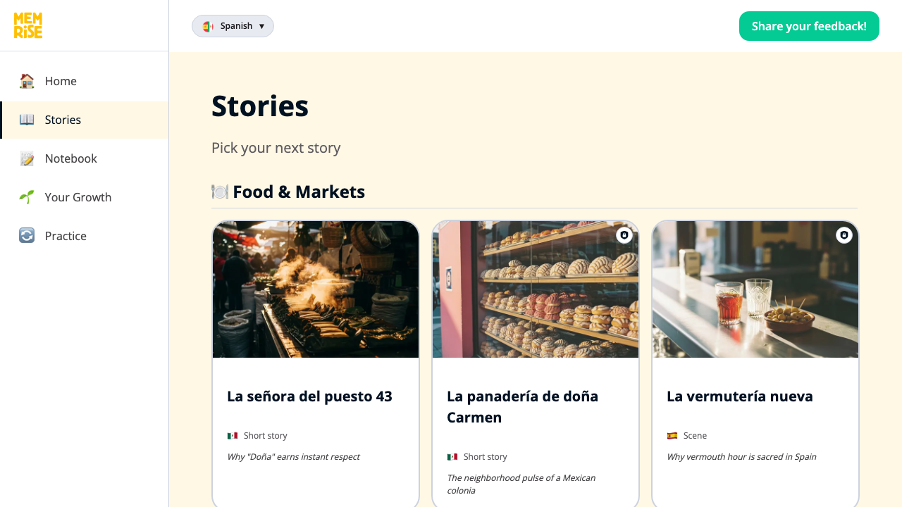

4. Story detail page shows preview text with tap-to-translate and metadata
   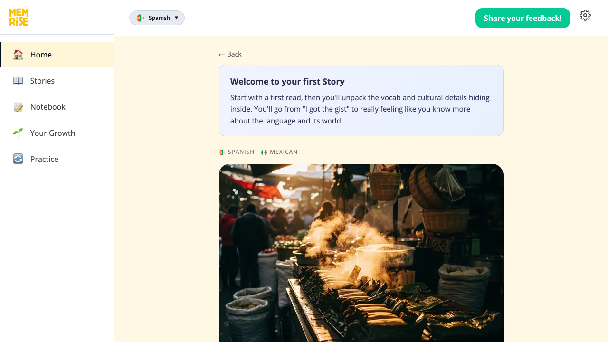

5. Stage 1 - First Read: User reads in target language with optional audio
   

6. User rates comprehension, enjoyment, and difficulty

7. Stage 2 - Discover: Vocabulary breakdown into Key Phrases, Slang, Cultural Insights

8. Stage 3 - Re-read: Bilingual view with translation toggle

9. Stage 4 - Check: Sentence reordering comprehension exercise

10. Stage 5 - Score: Final self-assessment and completion summary

### 7.8 Upgrading to Pro

1. User encounters a gated feature or clicks "Upgrade to Pro" from sidebar/banner

2. Pricing page displays: "A whole new culture. For less than a coffee a day."

3. Three plan options with savings highlighted:
   - Lifetime: €76.50 (70% off, "BEST VALUE")
   - Annual: €69.99/yr, €0.20/day (73% savings)
   - Monthly: €21.99, €0.74/day
   

4. User selects a plan and completes payment

5. Confirmation page acknowledges successful subscription

6. All Pro features are immediately unlocked

---

## 8. Edge Cases

| Scenario | Handling |
|----------|----------|
| **Failed signup** | If the email is already registered, the system displays an appropriate error message and offers sign-in link |
| **Unsupported language pair for features** | Speak tab shows "Speaking practice not available" banner. Explore tab hides unsupported feature cards. Sidebar adapts to only show available tabs |
| **Free user hitting Pro gates** | Feature Upsell Modal appears with specific messaging per feature type (videos, conversations, review modes, buddy types, AI generation). Links to pricing page |
| **Free tier conversation exhaustion** | When free user runs out of messages (~10 per session), input field shows "Messages left: 0" and further input is disabled |
| **Empty state - My Words** | When no words have been learned, the My Words page shows an empty state with encouragement to start learning |
| **Empty state - Notebook** | New users see empty Notebook tabs with no content until they save items from stories |
| **Streak reset** | If a user misses a day, the streak resets to zero. Manual override available in Learning Settings |
| **No pronunciation buddy available** | The Pronunciation Card is hidden from both Home and Speak pages when the pronunciation buddy is not available for the language pair |
| **No immerse data available** | The Immerse Card is hidden from the Home page when no videos exist for the language pair |
| **Labs no prototypes available** | If no Labs prototypes match the current language pair, the Labs page shows an empty state |
| **Trial expiry** | Pro Trial Expired Modal appears when the 3-day trial ends, prompting user to subscribe or continue on free tier |
| **Multiple products confusion** | Users navigate between Self-Study and Stories with different navigation structures. Stories has its own onboarding and settings |
| **Language-dependent sidebar** | Features appear/disappear based on selected language. Switching languages may cause unexpected navigation changes |
| **Wordlist completion** | When a user completes all words in their current word list, a completion screen appears with next-step recommendations |
| **Network errors** | Full-page error component displayed for API failures. React Query handles retry logic |
| **Exam Prep via external app** | Exam Prep loads in an embedded Kotlin application; connectivity issues or JS errors in the embedded app may cause blank screens |

---

## 9. Non-Functional Requirements

| Category | Requirement |
|----------|-------------|
| **Performance** | Vocabulary lessons with video should load within 3 seconds on standard broadband. Audio playback should begin within 1 second of pressing play. React Query caching reduces redundant API calls (stale times configured per query) |
| **Scalability** | The platform serves 370,000+ Pro subscribers and must handle concurrent learning sessions across all languages. API calls are deduplicated with React Query |
| **Availability** | 24/7 availability required as users learn across all time zones. Kubernetes-based infrastructure with health checks |
| **Security** | Secure credential storage. OAuth 2.0 for social auth (Google, Facebook, Apple). Session management via secure cookies. Sentry error reporting excludes sensitive data |
| **Privacy** | GDPR compliance: users can download personal data and delete accounts. Cookie consent required for EU users. Analytics tracking via Snowplow with consent management |
| **Accessibility** | "Skip to main content" links, ARIA labels on interactive elements, keyboard navigation support in lessons. Responsive design for screen readers |
| **Localization** | Platform interface available in 23 languages: Arabic, Chinese Simplified, Chinese Traditional, Dutch, English (UK), English (US), French, German, Hindi, Indonesian, Italian, Japanese, Korean, Norwegian, Persian, Polish, Portuguese (Brazil), Russian, Spanish, Spanish (Mexico), Swedish, Turkish, Vietnamese |
| **Mobile Responsiveness** | Responsive design with mobile-first approach. Mobile navigation bar replaces sidebar on small viewports. Media queries at theme breakpoints |
| **Content Delivery** | Native speaker videos and audio served via CDN. Image optimization for lesson cards and UI assets |
| **Data Persistence** | Learning progress, streaks, notebook entries, and word list subscriptions persist reliably across sessions. React Query cache with configurable stale/GC times |
| **Analytics** | Multi-provider analytics: Snowplow (event tracking), Braze (engagement), Datadog (performance monitoring). Google Tag Manager data layer integration |
| **Error Monitoring** | Sentry integration for client-side error tracking across all pages. Full-page error boundaries for graceful degradation |
| **Reliability** | API status checks and health monitoring. Graceful degradation when individual features are unavailable |

---

## 10. Assumptions and Unknowns

### Confirmed Facts (from codebase analysis)

1. **Spring Cleaning is fully rolled out:** The isSpringCleaning threshold is set to userId > 0, meaning all users see the new Spring Cleaning navigation layout (Home, Learn, Speak, Explore tabs).

2. **Geo-based pricing:** Pricing varies by country/region. The Euro amounts shown (Lifetime €76.50, Annual €69.99/yr, Monthly €21.99/mo) are region-specific. Lifetime pricing shows 70% off from €254.99.

3. **Token-based feature gating:** Pro features use a granular token system where each feature type (videos, conversations, review modes, individual buddy types, AI word generation) has independent availability checks.

4. **Labs prototypes are hosted externally:** All Labs features are Replit-hosted applications that receive authentication tokens from the main platform. They are language-pair filtered.

5. **Stories is a separate Replit app:** Memrise Stories is hosted externally and opened via authenticated redirect, not built into the main web client SPA.

6. **Exam Prep is a separate Kotlin app:** Exam preparation is delivered via an embedded Kotlin application, separate from the main React codebase.

7. **AI Buddies expanded to 7+ types:** Beyond the original 6, buddies now include Translator and Culture types with per-type Pro gating.

8. **Consumer subscriptions are the sole revenue model:** No institutional or B2B licensing. Revenue comes from consumer Pro subscriptions.

9. **Conversations support voice input:** The conversation interface supports both text input and microphone-based voice input for speaking practice.

10. **Experience versioning:** The platform supports "2024" and "2025" experience types, with 2025 being the current default that enables the Spring Cleaning layout.

### Assumptions

1. **Pro subscription spans all products:** A single Pro subscription is assumed to unlock premium features across the Self-Study App, Stories, and Labs prototypes.

2. **Mobile apps mirror web features:** The web product references mobile apps; it is assumed the mobile experience includes additional features like push notifications, offline mode, and device-native speech recognition.

3. **Spaced repetition algorithm:** The Review and Speed Review session types with configurable intervals strongly suggest a spaced repetition algorithm underlies vocabulary review.

4. **Stories are human-authored:** Based on previous stakeholder input, all story content is written by human authors rather than AI-generated.

### Unknowns

1. **Revenue model details:** Conversion rates between free and Pro tiers, trial-to-paid conversion, and relative proportion of Monthly/Annual/Lifetime subscribers.

2. **AI model backing:** Which language models power MemBot conversations, AI Buddies, pronunciation feedback, and exam prep grading.

3. **Offline capabilities:** Whether the web app supports any offline learning (service worker caching), and what offline features mobile apps provide.

4. **A/B testing:** Whether different users see different onboarding flows, pricing, or feature gates via feature flags.

5. **Points/levels algorithm:** How points are calculated per activity type, what triggers level-ups, and how stage progression is determined.

6. **Stories language expansion:** Stories currently supports limited languages. The expansion roadmap is unknown.

7. **Podcast feature scope:** "Interactive English Podcasts" appears in Labs; its relationship to the core product and expansion plans are unclear.

8. **Daily.co integration:** The codebase includes Daily.co video SDK dependencies, suggesting potential live video/call features that may not yet be publicly visible.

9. **Notification system:** Whether the platform sends email reminders, streak warnings, or learning nudges is not visible from the web interface alone.

10. **Community moderation scaling:** How quality control works as community word lists grow, beyond the basic reporting/flagging system.
